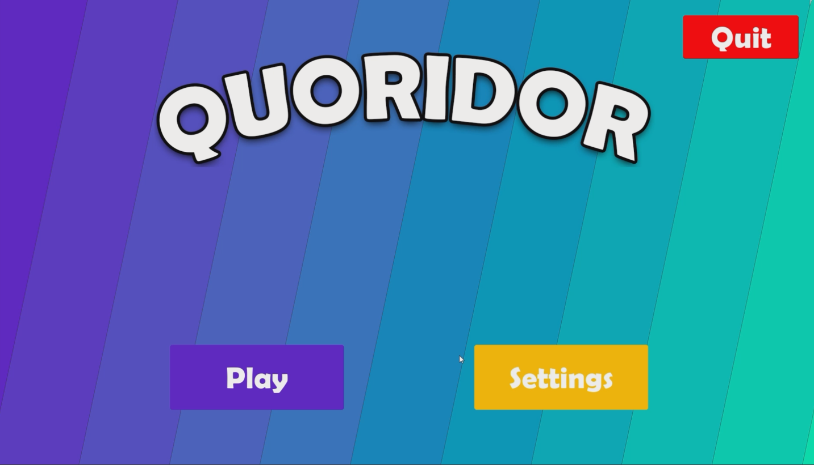

# Quoridor 2D – Détails du projet



## Contexte
Projet scolaire visant à implémenter **Quoridor** en 2D avec gestion des règles officielles, déplacements des pions, placement des murs et vérification des chemins.

## Objectifs techniques
- Moteur de règles et validation des coups
- Détection de chemin restant (BFS)
- Interface 2D fluide (Pygame)
- Architecture modulaire (moteur / UI)

## Points clés
- Algorithme BFS pour s'assurer qu'un mur ne bloque pas définitivement un joueur
- Système d'événements pour découpler l'UI du moteur
- Sauvegarde/chargement des parties (JSON)

## Démos / médias
- Vidéo (placeholder) : https://example.com/demo-quoridor

## Extrait de code
```python
# Vérification de la possibilité d'atteindre la ligne d'arrivée
from collections import deque

def has_path(board, start, goal_rows):
    q = deque([start])
    seen = {start}
    while q:
        r, c = q.popleft()
        if r in goal_rows:
            return True
        for nr, nc in neighbors(board, r, c):
            if (nr, nc) not in seen:
                seen.add((nr, nc))
                q.append((nr, nc))
    return False
```
