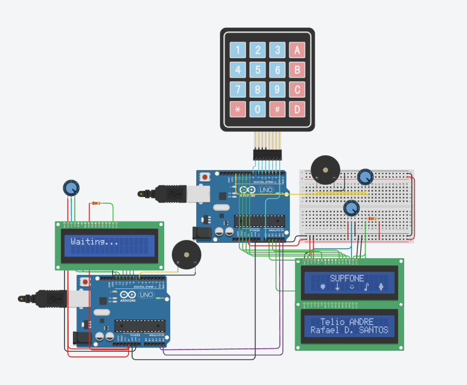

# Téléphone IoT



## Contexte

Projet de création d'un système de téléphonie embarqué utilisant deux Arduino communicant via le protocole I2C (Inter-Integrated Circuit). L'objectif était de simuler les fonctionnalités d'un téléphone mobile classique : messagerie, gestion de contacts, sonneries personnalisables et contrôles de volume/luminosité.

Le système repose sur une **architecture client-serveur** où l'Arduino 1 (émetteur) envoie des messages à l'Arduino 2 (récepteur) via le bus I2C. Chaque Arduino dispose de son propre écran LCD 16x2 pour afficher les menus et messages.

## Objectifs

- Implémenter une **communication I2C bidirectionnelle** entre deux Arduino
- Créer une **interface utilisateur intuitive** avec clavier matriciel 4x4
- Développer un **système de messagerie** avec saisie T9 (multi-tap)
- Gérer un **répertoire de contacts** (ajout, modification, suppression, consultation)
- Intégrer un **lecteur de sonneries** avec 5 thèmes prédéfinis + compositeur personnalisé
- Afficher des **caractères custom** (émojis : ❤️, ➡️, 😊, 🎵, ⬛)

## Technologies utilisées

**Hardware :**
- 2x Arduino (Uno ou compatible)
- 2x LCD 16x2 (LiquidCrystal)
- 1x Clavier matriciel 4x4
- 1x Buzzer piezo
- Connexions I2C (SDA, SCL)

**Software :**
- C++ (Arduino IDE)
- Bibliothèques : `Wire.h` (I2C), `LiquidCrystal.h`, `Keypad.h`

## Fonctionnalités principales

### 📱 Arduino 1 (Émetteur) - Menu principal

**Navigation dans le menu :**
- `A` : Menu suivant
- `B` : Menu précédent
- `C` : Valider/Entrer
- `D` : Retour/Annuler

**Menu 1 : Message**
- Saisie de texte via système T9 multi-tap :
  - Touche `1` : a, b, c (appuis multiples)
  - Touche `2` : d, e, f
  - Touche `3` : g, h, i
  - Touche `4` : j, k, l
  - Touche `5` : m, n, o
  - Touche `6` : p, q, r
  - Touche `7` : s, t, u
  - Touche `8` : v, w, x
  - Touche `9` : y, z
- Insertion d'émojis custom : `A`, `B`, `C`, `0`, `#`
- `*` : Envoyer le message (transmission I2C)
- Limite : 32 caractères affichés sur 2 lignes

**Menu 2 : Contact**
- `1` : Ajouter un contact (numéro 10 chiffres + port I2C)
- `2` : Lister les contacts (navigation avec `*`/`#`)
- `3` : Modifier un contact existant
- `4` : Supprimer un contact
- Capacité : 10 contacts maximum

**Menu 3 : Musique**
- `1-5` : Jouer des sonneries prédéfinies (thèmes célèbres)
- `6` : Jouer une composition personnalisée
- `#` : Accéder au mode compositeur

**Mode Compositeur :**
- `1-7` : Notes de musique (Do, Ré, Mi, Fa, Sol, La, Si)
- `8` : Augmenter la durée (+100ms)
- `9` : Diminuer la durée (-100ms)
- `0` : Toggle enregistrement
- `#` : Retour au menu musique

**Menu 4 : Volume** (placeholder - contrôle potentiomètre externe)

**Menu 5 : Brightness** (placeholder - contrôle potentiomètre externe)

### 📲 Arduino 2 (Récepteur)

- **Écoute permanente** sur le bus I2C (adresse périphérique `3`)
- Affiche "Waiting..." au démarrage
- **Réception de messages** :
  - Affichage du message sur LCD (2 lignes)
  - Buzzer confirmation (ton aigu si OK, grave si erreur)
  - Validation de la réception non-vide
- Réinitialisation automatique du buffer après affichage

## Architecture technique

### Communication I2C

```cpp
// Arduino 1 (Contrôleur)
Wire.begin();
Wire.beginTransmission(3);  // Adresse du périphérique
Wire.write(message);
Wire.endTransmission();

// Arduino 2 (Périphérique)
Wire.begin(3);  // Adresse 3
Wire.onReceive(receiveEvent);
```

### Gestion mémoire

```cpp
// Stockage contacts (Arduino 1)
char contactNumber[10][11];  // 10 numéros de 10 chiffres
char contactPort[10][2];     // Ports I2C associés

// Buffer message (Arduino 2)
char receivedMessage[33];    // 32 chars + '\0'
```

### Caractères personnalisés LCD

```cpp
byte heart[8] = {
  0b00000, 0b01010, 0b11111, 0b11111,
  0b11111, 0b01110, 0b00100, 0b00000
};
lcd.createChar(1, heart);  // Accessible via lcd.write(1)
```

## Défis techniques

### 1. Timing du système T9
Utilisation de `millis()` pour détecter les appuis multiples rapides (fenêtre de 500ms) :
```cpp
unsigned long start = millis();
int pressedCount = 0;
while (millis() - start < 500) {
  if (keypad.getKey() == '1') {
    pressedCount++;
    delay(50);  // Debounce
  }
}
// Mapping pressedCount → lettre
```

### 2. Synchronisation I2C
- Gestion du **buffer overflow** (limite 32 bytes)
- Validation des messages vides pour éviter les faux positifs
- Utilisation d'un **callback asynchrone** (`onReceive`) sur le périphérique récepteur

### 3. Gestion de l'état UI
- Machine à états avec `currentState` pour le menu
- Flags booléens : `messageMode`, `contactMode`, `musicMode`, `composerMode`
- Variable globale `canSwitchMenu` pour bloquer la navigation pendant les actions

## Médias

**Démonstration :**
- [Vidéo du système en action](#) *(à ajouter)*

**Points clés du code :**
- Architecture modulaire avec fonctions dédiées par feature
- Utilisation intensive de `strcmp()` et `strlen()` pour la manipulation de chaînes
- Gestion des tableaux 2D pour les contacts et compositions musicales
